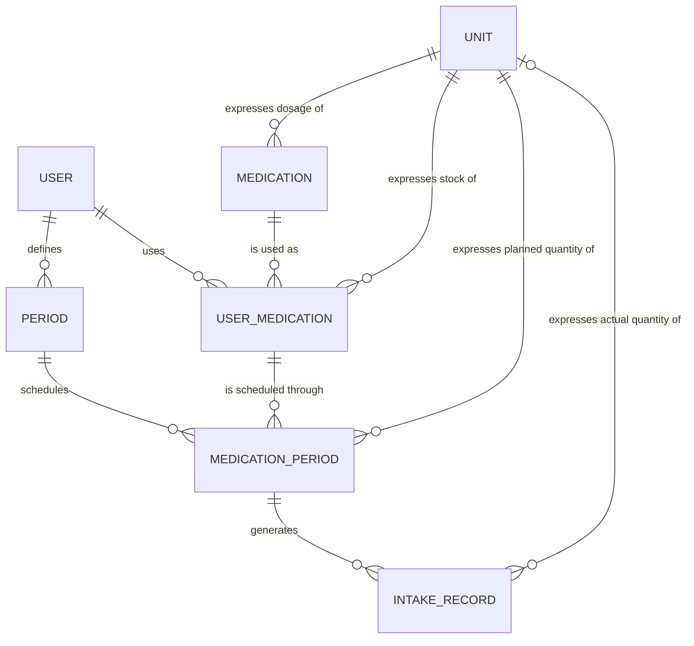

# Conceptual ERD

Conceptual entity-relationship diagram for Medication Manager. See [`../conceptual-model.md`](../conceptual-model.md) for the full description of entities, relationships and open questions.

## Reading the diagram

| Symbol | Meaning |
|--------|---------|
| `\|\|` | Exactly one |
| `o\|` / `\|o` | Zero or one |
| `o{` | Zero or many |

## Notes

- **User ↔ Medication** is many-to-many, resolved by `USER_MEDICATION`.
- **User Medication ↔ Period** is many-to-many, resolved by `MEDICATION_PERIOD`.
- **Same-user rule:** a `MEDICATION_PERIOD` must link a `USER_MEDICATION` and a `PERIOD` that belong to the same `USER`. This cross-relationship rule cannot be drawn in the diagram.
- **Unit link to `INTAKE_RECORD`** is optional because the actual quantity is recorded only when the intake is taken (`TAKEN`).
- **Ownership** of `MEDICATION_PERIOD` and `INTAKE_RECORD` is indirect, through `USER_MEDICATION`. `MEDICATION` and `UNIT` are shared and have no owner.
- Dosage (on `MEDICATION`), planned/actual intake quantity (on `MEDICATION_PERIOD` / `INTAKE_RECORD`) and stock (on `USER_MEDICATION`) are distinct concepts that all use `UNIT`.
